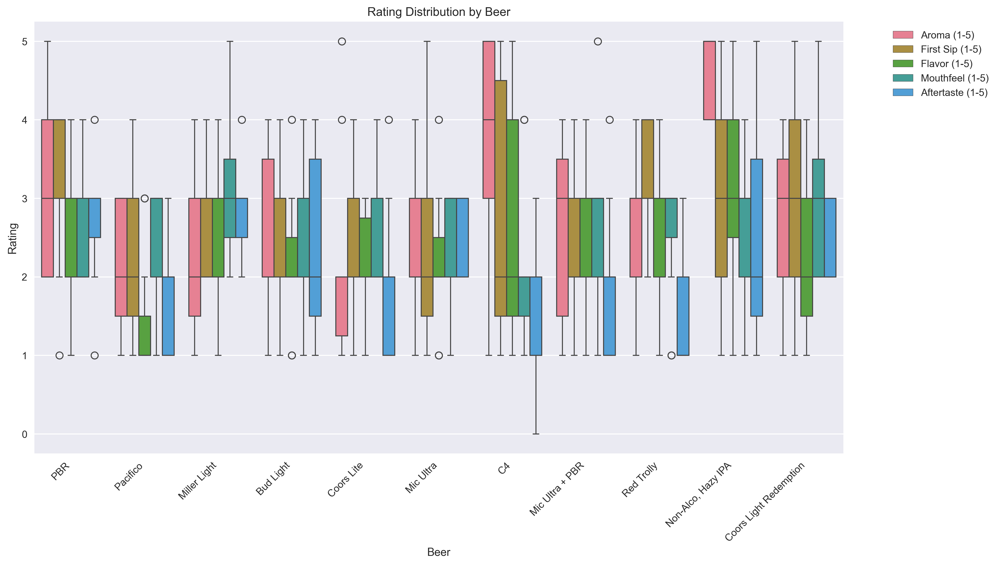

# The Best of the Worst Showdown

Welcome to the definitive study that nobody asked for: a **comprehensive**, **statistically sound**, and **deeply questionable** evaluation of the world’s most tragically drinkable beers. What started as a group of friends sipping swill turned into a data science project for the ages.

Objective: **Find the best of the worst.**

## Summary of Findings

After analyzing scores from 11 courageous judges across 10+ budget beers, here's how the froth settled:

### The Least Terrible Beer

**Non-Alco, Hazy IPA**
_Average Score: 3.24_
"This beer is like watching a bad movie that unexpectedly makes you cry. Technically non-alcoholic, emotionally intoxicating."

### The Most Universally Hated

**Pacifico**
_Average Score: 1.98_
"Described as 'tastes like water' but somehow worse. A real overachiever in underperformance."

### Most Polarizing

**C4**
_Standard Deviation: 1.35_
With scores ranging from a full 5 to a literal zero, this beer divided the group more than pineapple on pizza.

## Figures


*Some bars are lower than our standards.*


*Plot twist: Aroma matters until you take a sip.*

## Judge Behavior

### Most Consistent
**Lars** – A beacon of reliability in a sea of subjectivity.

### Most Chaotic
**Manu & Domi** – Known to give wildly varying scores. Unpredictable, like the beers.

### Harshest Critic
**Matt & Emma** – If they gave it a 3, it was probably exceptional.

## TL;DR: Final Rankings

| Rank | Beer                  | Avg Score |
|------|-----------------------|-----------|
| 1    | Non-Alco, Hazy IPA    | 3.24      |
| 2    | PBR                   | 2.93      |
| 3    | Coors Light Redemption| 2.69      |
| 4    | Miller Light          | 2.67      |
| 5    | C4                    | 2.56      |
| 6    | Red Trolly            | 2.49      |
| 7    | Bud Light             | 2.45      |
| 8    | Mic Ultra             | 2.45      |
| 9    | Mic Ultra + PBR       | 2.36      |
| 10   | Coors Lite            | 2.24      |
| 11   | Pacifico              | 1.98      |

_The true winner? Friendship. And maybe the recycling industry._

---

## Reproducing the Analysis

Install dependencies:

```bash
pip install -r requirements.txt